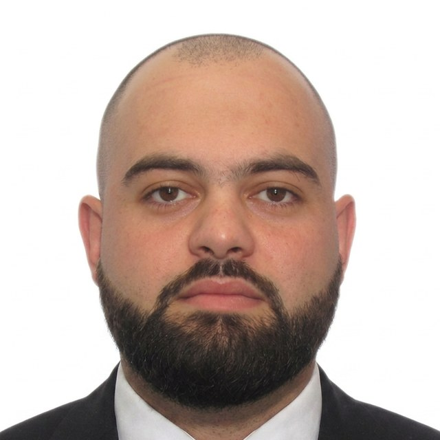

```{=html}
<section class="hero">
  <div class="hero-inner">
    <div>
      <p class="hero-role">Senior Project Manager in financial services</p>
      <h1>Fuad Babaiev</h1>
      <p class="hero-lede">I turn complex technology and finance initiatives into delivered results, from a bitcoin exchange in 2013 to executive reporting automation at a Fortune 500 insurer today.</p>
      <div class="hero-actions">
        <a class="btn-solid" href="projects.html">See my projects</a>
        <a class="btn-line" href="files/Fuad_Babaiev_CV.pdf">Download CV</a>
      </div>
    </div>
    
  </div>
</section>

<section class="chain-section" aria-labelledby="chain-title">
  <div class="chain-head">
    <h2 id="chain-title">My career, block by block</h2>
    <p>Each block links to the one before it. Scroll sideways to follow the chain.</p>
  </div>
  <div class="chain" id="chain" tabindex="0" aria-label="Career timeline">
    <article class="block"><div class="year">2008</div><div class="name">Law school</div><div class="what">LLB and LLM in International Law, National Law Academy of Ukraine</div><div class="hash"></div></article>
    <article class="block"><div class="year">2012</div><div class="name">Founder</div><div class="what">Café, retail, aviation travel and US-to-Ukraine car logistics businesses</div><div class="hash"></div></article>
    <article class="block"><div class="year">2013</div><div class="name">UkrExchange</div><div class="what">Co-founded one of Ukraine's first bitcoin-to-fiat exchanges</div><div class="hash"></div></article>
    <article class="block"><div class="year">2017</div><div class="name">Mining infrastructure</div><div class="what">Built a $500K+ ASIC and GPU mining operation with live P&amp;L dashboards</div><div class="hash"></div></article>
    <article class="block"><div class="year">2018</div><div class="name">Remote delivery</div><div class="what">PM for cross-functional teams building e-commerce, education, media and AI products</div><div class="hash"></div></article>
    <article class="block"><div class="year">2022</div><div class="name">Ireland</div><div class="what">PG Diploma in Global Capital Markets, Ulster University</div><div class="hash"></div></article>
    <article class="block"><div class="year">2023</div><div class="name">City of Portland</div><div class="what">Senior IT PM: infrastructure, cybersecurity and a PMO built from scratch</div><div class="hash"></div></article>
    <article class="block"><div class="year">2025</div><div class="name">Boston University</div><div class="what">MS in Financial Management (AI Applications)</div><div class="hash"></div></article>
    <article class="block current"><div class="year">2026</div><div class="name">MassMutual</div><div class="what">Senior PM, automating executive reporting and data quality</div><div class="hash"></div></article>
  </div>
</section>

<section class="focus" aria-label="Focus areas">
  <div>
    <h3>Delivery in regulated environments</h3>
    <p>Programs where mistakes cost money or compliance: financial services, police and 911 systems, port cybersecurity.</p>
  </div>
  <div>
    <h3>Fintech and digital assets</h3>
    <p>Exchange mechanics, fiat settlement, mining economics and the regulation that surrounds them.</p>
  </div>
  <div>
    <h3>AI and automation</h3>
    <p>Replacing manual reporting and data cleanup with pipelines, dashboards and LLM-assisted workflows.</p>
  </div>
</section>
```

::: {.home-body}

## About me

I am a project manager who started as an entrepreneur. After earning my LLB and LLM in International Law in Ukraine, I built and ran businesses in several niches: a lounge café, retail, an aviation travel agency, and a B2B and B2C logistics company that sourced cars from US insurance auctions (Copart, IAAI, Manheim) and handled everything through to delivery in Ukraine. In 2013 I co-founded UkrExchange, one of Ukraine's first bitcoin-to-fiat exchanges, and later delivered a crypto mining infrastructure project.

I then moved into project management with remote, cross-functional teams, delivering web applications and software in e-commerce, education, media and AI. After the full-scale war began in 2022, I relocated to Ireland and completed a Postgraduate Diploma in Global Capital Markets at Ulster University.

In the United States I joined the City of Portland, Maine, as Senior IT Project Manager. I led infrastructure, cybersecurity and enterprise systems projects and built the IT department's PMO guidelines from scratch.

To move into the financial domain, I enrolled in the MS in Financial Management (AI Applications) at Boston University, where I study AI and generative AI, blockchain, corporate finance, financial regulation and big data analytics. Fintech and blockchain are the areas I want to work in.

Today I am a Senior Project Manager (contract) at MassMutual, in the Global Business Services workforce planning team. I automate reporting for executive leadership and build automated data-cleaning and data-quality solutions.

## Education

- **Boston University**: MS in Financial Management (AI Applications), 2025–2027
- **Ulster University**: PG Diploma, Global Capital Markets (Fintech Management), 2022–2023
- **National Law Academy of Ukraine**: LLB and LLM, International Law, 2008–2013

## Certifications

PMP, SAFe Agilist, CSPO, PSM I, PRINCE2, Blockchain for Business and Finance

:::
