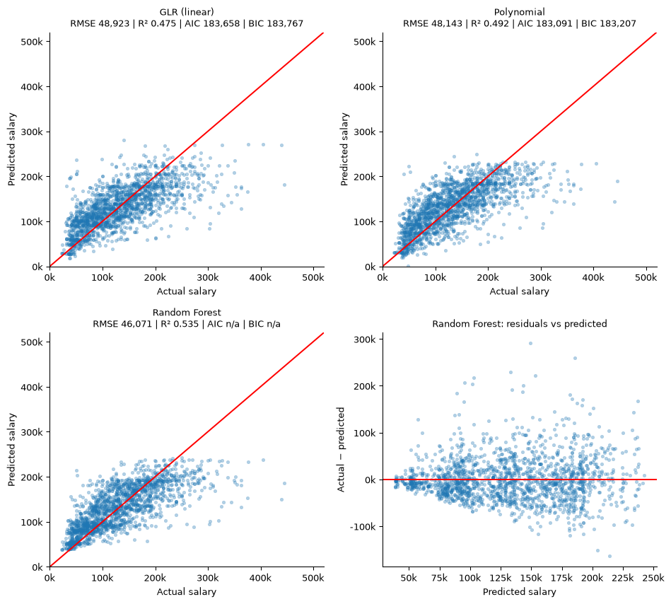
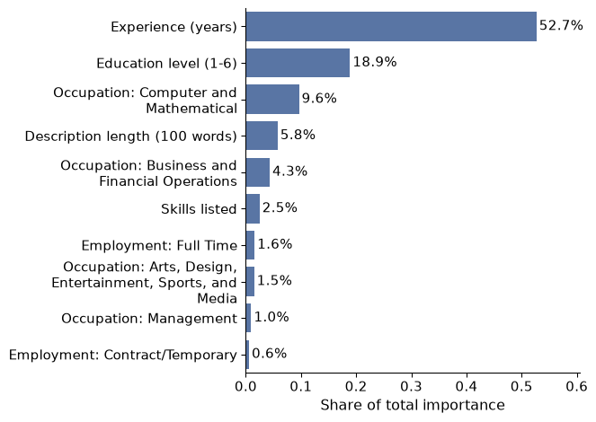

```{=html}
<div class="filters" role="group" aria-label="Filter projects">
  <button type="button" data-filter="all" aria-pressed="true">All</button>
  <button type="button" data-filter="data" aria-pressed="false">Data and AI</button>
  <button type="button" data-filter="pro" aria-pressed="false">Professional</button>
</div>
```

::::: {.pgrid}

:::: {.pcard data-cat="data"}
{fig-alt="Scatter plots of actual versus predicted salary for linear, polynomial and random forest models, plus a residual plot"}

### Salary prediction with PySpark ML

[Big Data and Cloud Analytics, Boston University, 2026]{.where}

Predicted annual salary for 9,300 US job postings with Spark on AWS EC2. I rebuilt the salary target from mixed hourly and annual pay, extracted required experience from posting text, and compared linear, polynomial and random forest models. The random forest reached a test R² of 0.54; experience showed a strongly diminishing return after about 12 years.

[PySpark MLlib, AWS EC2, Python, Seaborn, Quarto]{.tools}
::::

:::: {.pcard data-cat="data"}
{fig-alt="Bar chart of random forest feature importance, led by experience at 52.7 percent"}

### What drives pay in job postings

[Big Data and Cloud Analytics, Boston University, 2026]{.where}

Required experience explains just over half of the model's predictive power, followed by education level and occupation, with computing roles paying the most.

[Random forest, feature importance]{.tools}
::::

:::: {.pcard data-cat="data"}
[7,074]{.metric}

[job postings analysed]{.metric-label}

### Career market analysis: securities and investments

[Group project, Boston University, 2026]{.where}

Which skills, locations and role variants open entry into BI and data analyst careers in US securities and investments. I led site structure, integration and publishing, and documented four data defects we repaired.

[Visit the project website](https://fuadbbv.github.io/ad688-career-evaluation-group1/)

[Python, pandas, Quarto, GitHub Pages]{.tools}
::::

:::: {.pcard data-cat="data"}
[Mesa]{.metric}

[agent-based simulation]{.metric-label}

### Agent-based financial modeling

[AI Agents and Automation, Boston University]{.where}

Built agent-based simulations to test how trading strategies and market participants interact, and analysed the simulated scenarios in Python.

[Python, Mesa, pandas, matplotlib]{.tools}
::::

:::: {.pcard data-cat="pro"}
[~2 days]{.metric}

[of manual work saved per reporting cycle]{.metric-label}

### Executive reporting automation

[MassMutual, Global Business Services, 2026]{.where}

Automated recurring hiring, headcount and budget reporting: data pulled from the ServiceNow API, orchestrated in Power Automate and published as self-service Tableau dashboards for leadership.

[ServiceNow API, Power Automate, Tableau, Copilot]{.tools}
::::

:::: {.pcard data-cat="pro"}
[Self-correcting]{.metric}

[data-quality loop]{.metric-label}

### Data integrity checker

[MassMutual, 2026]{.where}

Designed a validation system that checks every record against business rules, finds the accountable owner and emails a targeted correction request, with a KPI tracker measuring how fast gaps get fixed.

[Python, Excel, business-rule validation]{.tools}
::::

:::: {.pcard data-cat="pro"}
[1,500+]{.metric}

[users moved to one ITSM platform]{.metric-label}

### HaloITSM implementation

[City of Portland, Maine, 2023–2026]{.where}

Led the enterprise rollout of a new service management platform: vendor engagement, workflow and catalog design, data migration, cutover and stabilization without operational disruption.

[HaloITSM, ITIL, change management]{.tools}
::::

:::: {.pcard data-cat="pro"}
[CJIS]{.metric}

[compliant MFA for police systems]{.metric-label}

### Multi-factor authentication for the police department

[City of Portland, Maine]{.where}

Translated CJIS and FIPS 140-2 requirements into a phased rollout of hardware and mobile MFA for dispatchers and officers, with break-glass procedures and zero downtime during critical hours.

[CJIS, FIPS 140-2, identity management]{.tools}
::::

:::: {.pcard data-cat="pro"}
[2013]{.metric}

[bitcoin-to-fiat, before the playbooks existed]{.metric-label}

### UkrExchange

[Co-founder and product manager]{.where}

Co-founded one of Ukraine's first BTC-to-fiat exchanges. Designed trading and settlement workflows and integrated local banking APIs to automate fiat deposits and withdrawals.

[Order books, settlement, KYC/AML, banking APIs]{.tools}
::::

:::: {.pcard data-cat="pro"}
[$500K+]{.metric}

[mining infrastructure delivered]{.metric-label}

### Crypto mining infrastructure

[Independent project, 2017–2022]{.where}

Took an ASIC and GPU mining operation from vendor sourcing and facility build-out to launch, with minute-level revenue and cost dashboards and a hosted-mining revenue stream.

[ASIC/GPU, mining pools, P&L dashboards]{.tools}
::::

:::::
